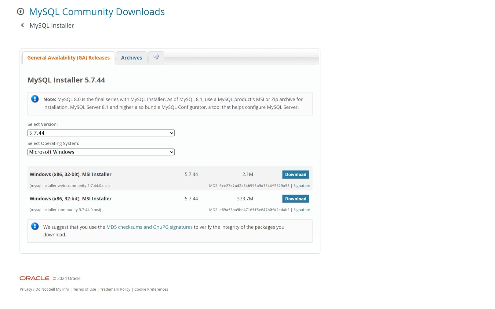

# Dev_Setup
Setup Development Environment

#Assignment: Setting Up Your Developer Environment

#Objective:
This assignment aims to familiarize you with the tools and configurations necessary to set up an efficient developer environment for software engineering projects. Completing this assignment will give you the skills required to set up a robust and productive workspace conducive to coding, debugging, version control, and collaboration.

#Tasks:

1. Select Your Operating System (OS):
   Choose an operating system that best suits your preferences and project requirements. Download and Install Windows 11. https://www.microsoft.com/software-downlo![alt text]
   (Screenshot_19-6-2024_12756_www.microsoft.com.jpeg)ad/windows11

   
Step 1: Choose an Operating System
For this guide, we'll use Windows 11 as it provides a modern interface and features suitable for a wide range of applications and development tasks.

Step 2: Download and Install Windows 11
Prerequisites:
Ensure your PC meets the minimum system requirements for Windows 11. You can check the requirements here.
Steps to Download and Install Windows 11:
Go to the Windows 11 Download Page:

Open your web browser and navigate to the Windows 11 download page.
Download the Installation Assistant:

Click on the "Download Now" button under the "Windows 11 Installation Assistant" section.
Run the Installation Assistant:

Locate the downloaded file (usually named Windows11InstallationAssistant.exe) and double-click to run it.
Follow the on-screen instructions to upgrade your current Windows version to Windows 11.
Create Installation Media (Optional):

If you prefer a clean install or need to install Windows 11 on a different device, you can create installation media.
Click on the "Download Now" button under the "Create Windows 11 Installation Media" section.
Run the Media Creation Tool and follow the prompts to create a bootable USB drive or DVD.
Installing Windows 11 Using Installation Media:

Insert the bootable USB drive or DVD into your PC.
Restart your PC and boot from the installation media.
Follow the on-screen instructions to perform a clean installation of Windows 11.
Screenshots (if applicable):
Include screenshots of key steps such as downloading the Installation Assistant, running it, and any critical installation screens.

2. Install a Text Editor or Integrated Development Environment (IDE):
   Select and install a text editor or IDE suitable for your programming languages and workflow. Download and Install Visual Studio Code. https://code.visualstudio.com/Download

You can download Visual Studio Code (VS Code) from the official website. Choose the appropriate version for your operating system:

Windows: User Installer or System Installer for x64 or Arm64
macOS: .zip for Intel chip, Apple silicon, or Universal
Linux: .deb for Debian/Ubuntu, .rpm for Red Hat/Fedora/SUSE, or .tar.gz for other distributions
Visit Visual Studio Code Download to get started.

3. Set Up Version Control System:
   Install Git and configure it on your local machine. Create a GitHub account for hosting your repositories. Initialize a Git repository for your project and make your first commit. https://github.com

   

  A. Install Git
On Windows:
Download Git from the official website: Git for Windows.
Run the installer and follow the default settings.
On macOS:
Install Homebrew if you haven't already: /bin/bash -c "$(curl -fsSL https://raw.githubusercontent.com/Homebrew/install/HEAD/install.sh)"
Install Git: brew install git
On Linux:
Open a terminal.
Install Git using the package manager. 
B. Configure Git
Open a terminal or command prompt and configure your Git user name and email:
git config --global user.name "Your Name"
git config --global user.email "your.email@example.com"
C. Create a GitHub Account
Go to GitHub.
Click on "Sign up" and follow the instructions to create your account.
D. Create a New Repository on GitHub
Once logged in, click the "+" icon in the top right corner and select "New repository".
Fill in the repository name and description (optional).
Choose the repository's visibility (public or private).
Click "Create repository".
E. Initialize a Git Repository Locally
Open a terminal or command prompt.
Navigate to your project directory or create a new one
mkdir my-project
cd my-project
F.Initialize the Git repository
git init
G. Connect the Local Repository to GitHub
Add the remote repository (replace username and repository with your GitHub username and repository name):
git remote add origin https://github.com/username/repository.git
H. Make Your First Commit
Create a README file:
echo "# My Project" > README.md
Add the file to the staging area:git add README.md
Commit the file:git commit -m "Initial commit"
I. Push Your Changes to GitHub
git push -u origin master
Summary
You have now installed Git, configured it on your local machine, created a GitHub account, initialized a local Git repository, connected it to GitHub, made your first commit, and pushed your changes. You can verify this by visiting your GitHub repository page where you should see the README file and your initial commit.

4. Install Necessary Programming Languages and Runtimes:
  Instal Python from http://wwww.python.org programming language required for your project and install their respective compilers, interpreters, or runtimes. Ensure you have the necessary tools to build and execute your code.

Step 1: Download Python
Visit the Python website:
Go to the official Python download page at Python Downloads.

Select the version:
Choose the version of Python you need. It's generally recommended to download the latest stable release. For most users, Python 3.x is the preferred version.

Download the installer:

For Windows: Download the executable installer (.exe).
For macOS: Download the macOS installer (.pkg).
For Linux: Python is often pre-installed, but you can also use your package manager to install it (apt, yum, etc.).
Step 2: Install Python
For Windows:
Run the installer:
Double-click the downloaded installer.

Add Python to PATH:
Make sure to check the box that says "Add Python to PATH" during the installation process. This will make it easier to run Python from the command line.

Customize installation:
You can choose to customize the installation if needed, but the default settings are typically sufficient. Click "Install Now" to proceed with the default settings.

For macOS:
Run the installer:
Open the downloaded .pkg file and follow the on-screen instructions to install Python.

Verify the installation:
Open a terminal and type python3 --version to ensure Python 3 is installed correctly.
Step 3: Install Additional Tools
pip (Python package manager):
pip is usually included with Python installations. You can verify its installation by running pip --version (or pip3 --version).

Virtual environments:
It's a good practice to use virtual environments to manage project dependencies. You can create a virtual environment using venv:
Step 4: Verify Installation
To ensure everything is set up correctly, create a simple Python script:
You should see the output Hello, Python!.

By following these steps, you'll have Python and the necessary tools installed and configured for your project. If you need further assistance or have specific requirements, feel free to ask!

5. Install Package Managers:
   If applicable, install package managers like pip (Python).

   For Windows:
Check if Python is installed:
Open Command Prompt and type:python --version
Ensure pip is installed:
After installing Python, pip should be installed automatically. You can check if pip is installed by typing:pip --version
If pip is not installed, you can manually install it by downloading get-pip.py and running it:curl https://bootstrap.pypa.io/get-pip.py -o get-pip.py
python get-pip.py

6. Configure a Database (MySQL):
   Download and install MySQL database. https://dev.mysql.com/downloads/windows/installer/5.7.html

   

   To configure a MySQL database, you can follow these steps to download, install, and set it up on your system:

Step 1: Download MySQL Installer
Go to the MySQL download page: MySQL Installer for Windows.
Click on the "Download" button for the MySQL Installer.
Choose between the web installer (smaller size, requires internet during installation) or the full installer (larger size, includes all components).
You might need to sign in or create an Oracle account, but there is also an option to skip this step by clicking on "No thanks, just start my download".
Step 2: Install MySQL
Once the installer is downloaded, run it.
Choose the setup type:
Developer Default: Installs all MySQL products needed for a development environment.
Server Only: Installs only the MySQL server.
Client Only: Installs MySQL client programs and libraries.
Full: Installs all MySQL products.
Custom: Allows you to select specific MySQL products to install.
Proceed with the installation by clicking "Next".
Step 3: Configure MySQL Server
After the installation, the MySQL Installer will prompt you to configure the MySQL Server. Click "Next".
Choose the following options during configuration:
Config Type: Select "Development Machine" for minimal memory usage, "Server Machine" for balanced usage, or "Dedicated Machine" for maximum memory usage by MySQL.
Connectivity: Ensure the TCP/IP port is set to 3306 (default). You can change it if necessary, but make a note of it.
Authentication Method: Use the "Use Strong Password Encryption for Authentication (RECOMMENDED)" option.
Set a root password and create any additional user accounts you need.
Configure MySQL as a Windows service and choose to start the MySQL Server when the system starts.
Complete the configuration and start the MySQL server.
Step 4: Verify MySQL Installation
Open the MySQL Command Line Client or use any MySQL client tool like MySQL Workbench.
Log in using the root account and password you created during configuration.
Run a simple SQL command to verify everything is working:
SHOW DATABASES;
Optional: Secure MySQL Installation
For additional security, you can run the mysql_secure_installation script which allows you to:

Set up a root password if you haven't already.
Remove anonymous users.
Disallow remote root login.
Remove the test database.
Reload the privilege tables.
Troubleshooting
If you encounter any issues during installation or configuration:

Ensure all prerequisites are installed, such as the required Visual C++ Redistributable.
Check the MySQL error log files for any specific errors.
Consult the MySQL documentation or community forums for additional help.
By following these steps, you should have a MySQL database installed and configured on your system.

7. Set Up Development Environments and Virtualization (Optional):
   Consider using virtualization tools like Docker or virtual machines to isolate project dependencies and ensure consistent environments across different machines.

   Docker
A. Install Docker
Windows/Mac: Download and install Docker Desktop from the Docker website.
Linux: Follow the installation instructions for your distribution on the Docker Engine installation page.
B. Create a Dockerfile
A Dockerfile is a script that contains a series of commands to build a Docker image. Here is a simple example for a Python project:
C. Build and Run the Docker Image
Build the image docker build -t my-python-app .
Docker Compose
For more complex setups, use Docker Compose to manage multi-container applications.
Virtual Machines
7.1. Install a Hypervisor
Windows: Install Hyper-V or VirtualBox.
Mac: Install VirtualBox or use the built-in Hypervisor.framework.
Linux: Install KVM or VirtualBox.
7.2. Create a VM
VirtualBox: Download from VirtualBox.org.
7.3. Setup VM
Install an OS: Download an ISO image of your desired operating system (e.g., Ubuntu).
Create a VM: Use the hypervisor’s GUI to create a new VM and attach the ISO image to install the OS.
7.4. Configure VM
Install Guest Additions (for VirtualBox): Enhances performance and usability (e.g., clipboard sharing, shared folders).
7.5. Install Development Tools
Install your development tools inside the VM as you would on a physical machine. For example, set up Python, Node.js, or any other dependencies your project needs.
Tips for Both Approaches
Environment Configuration
Environment Variables: Use environment variables to manage configuration.
Version Control: Ensure your Dockerfile or VM setup scripts are included in version control (e.g., Git).
Consistency
Documentation: Document the setup process to help others replicate the environment.
Automation: Automate the setup process using scripts (e.g., bash scripts) or tools like Ansible, Vagrant, or Terraform.
Example: Vagrant (for VMs)
Vagrant is a tool for building and managing virtualized development environments.
Install Vagrant: Download from Vagrantup.com.
Create a Vagrantfile:

8. Explore Extensions and Plugins:
   Explore available extensions, plugins, and add-ons for your chosen text editor or IDE to enhance functionality, such as syntax highlighting, linting, code formatting, and version control integration.

Visual Studio Code (VS Code)
VS Code is highly extensible with a vast marketplace for extensions.

Syntax Highlighting:

Python: Python Extension
JavaScript: JavaScript (ES6) code snippets
Linting:

ESLint: ESLint Extension
Pylint: Pylint Extension
Code Formatting:

Prettier: Prettier - Code formatter
Black (Python): Integrated within the Python Extension
Version Control Integration:

Git: Git Extension
GitLens: GitLens — Git supercharged
Other Useful Extensions:

Live Server: Live Server for live-reloading web development.
Docker: Docker Extension for working with Docker containers.
Sublime Text
Sublime Text is known for its speed and simplicity, and it also supports various plugins via Package Control.

Syntax Highlighting:

Babel: For ES6+ JavaScript syntax highlighting, install Babel.
Linting:

SublimeLinter: SublimeLinter with additional linters like SublimeLinter-eslint, SublimeLinter-pylint, etc.
Code Formatting:

JsPrettier: JsPrettier for JavaScript formatting.
Python PEP8 Autoformat: Python PEP8 Autoformat for Python code.
Version Control Integration:

GitGutter: GitGutter for Git diff in the editor.
Sublime Merge: Integrates with Sublime Merge, a dedicated Git GUI.
Other Useful Plugins:

Emmet: Emmet for HTML and CSS snippets.
Terminus: Terminus for terminal integration.
JetBrains IntelliJ IDEA
IntelliJ IDEA is a powerful IDE with robust built-in features and a plugin ecosystem.

Syntax Highlighting:

IntelliJ IDEA has extensive built-in support for multiple languages. Additional plugins can be found in the JetBrains Marketplace.
Linting:

CheckStyle-IDEA: CheckStyle-IDEA for Java.
SonarLint: SonarLint for on-the-fly linting in various languages.
Code Formatting:

Save Actions: Save Actions to format code on save.
Built-in formatters for languages like Java, JavaScript, Python, etc.
Version Control Integration:

IntelliJ IDEA has strong built-in support for Git, SVN, Mercurial, and other version control systems.
GitToolBox: GitToolBox for additional Git features.
Other Useful Plugins:

Database Navigator: Database Navigator for database management.
Docker: Docker Plugin for working with Docker.
Conclusion
Each of these text editors and IDEs offers a rich set of extensions and plugins to enhance development productivity. Depending on your specific needs, such as the programming languages you use or the development workflow you follow, you can customize your environment with these tools to create a powerful and efficient setup.

9. Document Your Setup:
    Create a comprehensive document outlining the steps you've taken to set up your developer environment. Include any configurations, customizations, or troubleshooting steps encountered during the process. 

Developer Environment Setup Documentation

Objective:
This document outlines the steps and configurations involved in setting up my developer environment. This setup is tailored for efficient software development, primarily focusing on web development using JavaScript, Node.js, and related technologies.

Operating System:

OS: Windows 10 / macOS / Linux (Specify your OS)
Software Tools:

Code Editor: Visual Studio Code

Installed extensions:
Live Server
ESLint
Prettier - Code formatter
GitLens
Docker
(Add any other relevant extensions)
Version Control: Git

Configurations:
Set up global username and email
SSH key for GitHub/GitLab authentication
Web Browser: Google Chrome / Mozilla Firefox / Edge (Specify your preference)

Terminal:

Windows: Git Bash / PowerShell / Windows Terminal
macOS / Linux: Terminal / iTerm2
Node.js Environment:

Installed Node.js version: (e.g., Node.js 14 LTS)
Package Manager: npm / Yarn
Database Management:

Database client: (e.g., MySQL Workbench, pgAdmin)
API Testing:

Postman / Insomnia
Setup Steps:

Code Editor Setup:

Installed Visual Studio Code from official website.
Configured settings.json for:
Preferred theme (e.g., Dark+)
Font family and size
Tab size (usually 2 spaces)
File associations
Version Control (Git):

Installed Git and configured global settings.
Generated SSH keys and added to GitHub/GitLab.
Node.js and npm/Yarn:

Installed Node.js LTS version via installer or package manager.
Verified installation using node -v and npm -v / yarn -v.
Set npm registry (if using npm): npm config set registry https://registry.npmjs.org/
Database Client Setup:

Installed MySQL Workbench / pgAdmin (or other relevant database client).
Connected to local/remote databases for development.
API Testing Setup:

Installed Postman / Insomnia for testing APIs.
Configured environments for different API endpoints.
Additional Configurations:

Configured PATH environment variables for Node.js/npm globally.
Integrated Git with Visual Studio Code.
Set up Live Server extension for auto-refreshing web applications.
Customizations:

Visual Studio Code:
Custom keybindings for common tasks.
Custom snippets for frequently used code patterns.
ESLint/Prettier configurations for code formatting.
Troubleshooting:

Node.js/npm/Yarn:
Handle permission issues with npm install.
Verify npm cache for dependency management.
Visual Studio Code Extensions:
Resolve compatibility issues after updates.
Address performance lag with large projects.
Conclusion:
This developer environment setup ensures a streamlined workflow for web development tasks, integrating essential tools like Visual Studio Code, Git, Node.js, and database clients. Regular updates and maintenance of dependencies and configurations are crucial for maintaining efficiency and productivity.

Next Steps:

Explore Docker for containerization in development.
Implement CI/CD pipelines for automated testing and deployment.
Version Control:

Version 1.0
Date:

June 19, 2024

#Deliverables:
- Document detailing the setup process with step-by-step instructions and screenshots where necessary.
- A GitHub repository containing a sample project initialized with Git and any necessary configuration files (e.g., .gitignore).
- A reflection on the challenges faced during setup and strategies employed to overcome them.

#Submission:
Submit your document and GitHub repository link through the designated platform or email to the instructor by the specified deadline.

#Evaluation Criteria:**
- Completeness and accuracy of setup documentation.
- Effectiveness of version control implementation.
- Appropriateness of tools selected for the project requirements.
- Clarity of reflection on challenges and solutions encountered.
- Adherence to submission guidelines and deadlines.

Note: Feel free to reach out for clarification or assistance with any aspect of the assignment.
